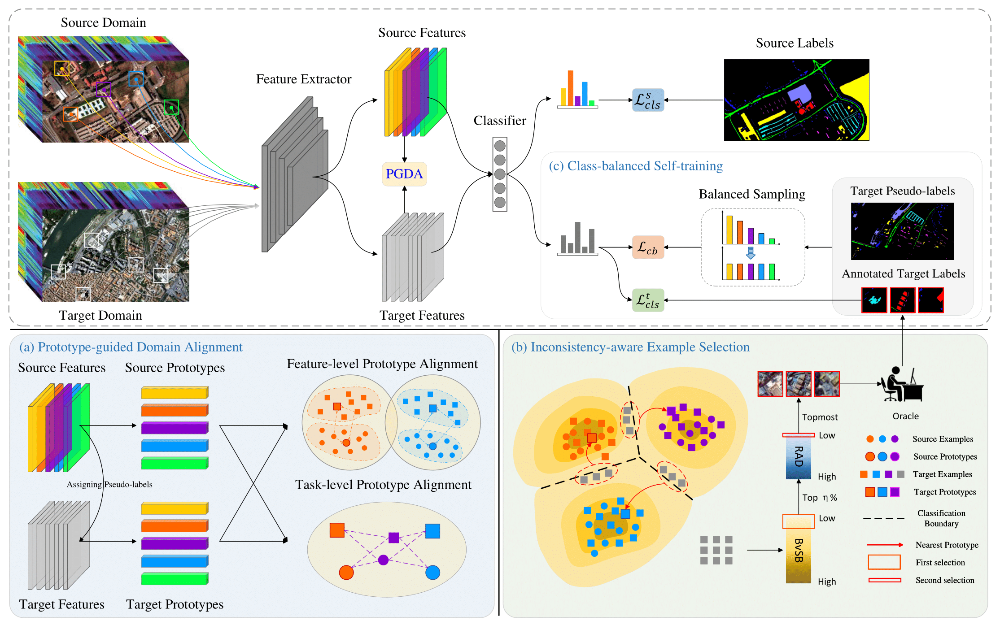

# [IEEE TGRS 2025] Official Implementation of Prototype-Guided Class-Balanced Active Domain Adaptation for Hyperspectral Image Classification

> **Authors:** 
> Haiyang Luo, 
> [Shengwei Zhong](https://gsmis.njust.edu.cn/open/TutorInfo.aspx?dsbh=Qoo2!0IeRoObZTQBF7xlYA==&yxsh=z70ppxVSQAs=&zydm=SwsWR9zpmmw=), 
> [Chen Gong](https://gcatnjust.github.io/ChenGong/index.html).

## Overview

The high cost of data annotation has become a major factor restricting the hyperspectral image (HSI) classification task. 
To address this issue, domain adaptation (DA) techniques have been developed to adapt models trained on abundantly labeled 
HSIs to those with scarce labels. As a novel DA paradigm, active domain adaptation (ADA) seeks to selectively annotate informative examples using active learning (AL) techniques under domain shift scenarios, ultimately enhancing model adaptation performance. 
However, current ADA methods require annotating a relatively large number of target examples, which is impractical for HSIs. Additionally, the target HSIs suffer from class imbalance, which limits the adaptation performance.

In this work, we propose a prototype-guided class-balanced active domain adaptation (PCADA) method for HSI classification.
PCADA method consists of three parts: prototype-guided domain alignment (PGDA) module, inconsistency-aware example selection (IES)
module, and class-balanced self-training (CBST) module. The PGDA module generates target prototypes based on highly confident pseudo-labels and aligns the distributions of two domains. The IES module identifies target-specific examples and select the most valuable ones for annotation. The CBST module generates pseudo-labels with balanced class distribution to solve the class imbalance issue in target domain.

The experimental results conducted on multiple benchmark HSI datasets demonstrate the superior performance of PCADA.



## Comparison with State-of-the-Art UDA

PCADA significantly outperforms previous works on several DA benchmarks. This includes Pavia University→Pavia Center and Houston2013→Houston2018 and Shanghai→Hangzhou.

|                  | Pavia University→Pavia Center | Houston2013→Houston2018 | Shanghai→Hangzhou |
|:----------------:|:-----------------------------:|:-----------------------:|:-----------------:|
|     AADA [1]     |         84.67 ± 2.92          |      59.61 ± 7.13       |   73.02 ± 5.26    |
|     SDM [2]      |         89.49 ± 1.68          |      82.63 ± 1.42       |   92.41 ± 1.05    |
|    LAMDA [3]     |         92.47 ± 1.50          |      82.27 ± 2.17       |   93.59 ± 0.74    |
|     LADA [4]     |         91.25 ± 1.81          |      75.79 ± 3.02       |   90.77 ± 2.88    |
|     CLCM [5]     |         90.62 ± 4.09          |      81.13 ± 1.58       |   90.14 ± 1.55    |
|    CPGAN [6]     |         92.09 ± 0.96          |      76.91 ± 2.19       |   88.01 ± 2.98    |
|     MSDA [7]     |         92.44 ± 0.98          |      81.03 ± 1.59       |   92.77 ± 1.66    |
|    IEH-DA [8]    |         93.50 ± 0.52          |      81.74 ± 3.66       |   90.63 ± 1.70    |
| **PCADA (Ours)** |       **95.06 ± 0.57**        |    **85.24 ± 2.01**     | **96.10 ± 1.33**  |

References:

1. Su et al. "Active adversarial domain adaptation" in WACV 2020.
2. Xie et al. "Learning distinctive margin toward active domain adaptation" in CVPR 2022.
3. Hwang et al. "Combating label distribution shift for active domain adaptation" in ECCV 2022.
4. Sun et al. "Local context-aware active domain adaptation" in ICCV 2023.
5. Ning et al. "Contrastive learning based on category matching for domain adaptation in hyperspectral image classification" in TGRS 2023.
6. Xie et al. "Class-wise prototype guided alignment network for cross-scene hyperspectral image classification" in TGRS, 2024.
7. Fang et al. "Masked self-distillation domain adaptation for hyperspectral image classification" in TGRS, 2024.
8. Zhang et al. "Easy-to-hard domain adaptation with human interaction for hyperspectral image classification" in TGRS, 2024.

## Setup Environment

For this project, we used python 3.9.21. We recommend setting up a new virtual environment:

**Step-by-step installation**

```bash
conda create --name pcada -y python=3.9
conda activate pcada

# this installs the right pip and dependencies for the fresh python
conda install -y ipython pip

pip install -r requirements.txt
```

All experiments were executed on an NVIDIA RTX 3090.

## Setup Datasets

You can download the hyperspectral datasets in mat format from [here](https://pan.baidu.com/s/184BXDD2KnlreqXX70Nar4Q?pwd=kfgj)
and move them to `dataset/` folder.

The final folder structure should look like this:

```none
PCADA
├── ...
├── dataset
│   ├── Houston
│   │   ├── Houston13.mat
│   │   ├── Houston13_7gt.mat
│   │   ├── Houston18.mat
│   │   ├── Houston18_7gt.mat
│   ├── Pavia
│   │   ├── paviaU.mat
│   │   ├── paviaU_gt_7.mat
│   │   ├── pavia.mat
│   │   ├── pavia_gt_7.mat
│   ├── Shanghai-Hangzhou
│   │   ├── DataCube.mat
├── ...
```

## Training
For convenience, we provide PCADA config files for different tasks. You can start the training job with the following command:

For Pavia task
```
python main.py --cfg configs/pavia.yaml
```

For Houston task
```
python main.py --cfg configs/houston.yaml
```

For Shanghai-Hangzhou task
```
python main.py --cfg configs/shanghai-hangzhou.yaml
```

## Checkpoints

Below, we provide checkpoints of PCADA for different benchmarks. As the results in the paper are provided as the mean over ten random seeds, we provide the checkpoint with the median validation performance here.

## Acknowledgements

This project is based on the following open-source projects. We thank their authors for making the source code publically available.

* [SCLUDA](https://github.com/Li-ZK/SCLUDA-2023/tree/main)
* [LAMDA](https://github.com/sehyun03/ADA-label-distribution-matching)
